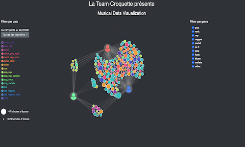

# Musical Data Visualization

This project aims at visualizing our music streaminc data from Spotify and responds to the following question : 

Which musics / music styles connects us and how much are they listened ?

The visualization is available at :  

https://la-team-croquette.github.io/Musical-Data-Visualization/visualisation/

#### Project made for the following course : https://lyondataviz.github.io/teaching/lyon1-m2/2021/

### Data 

The data was scraped from our personal accounts with the Spotify API : 

https://developer.spotify.com/documentation/web-api/reference/#/

### Sources and inspirations

https://observablehq.com/@nazareno/navegando-no-que-escutamos-no-spotify

https://observablehq.com/@a-lexwein/alexs-most-streamed-artists-and-tracks-on-spotify

https://observablehq.com/@bstaats/graph-visualization-introduction

Please go to the Wiki for more information !

 #### Made by : Victor FAVRE | Jeremy KRITIKOS | Tom MONTAURIOL | Marion Vertessen
